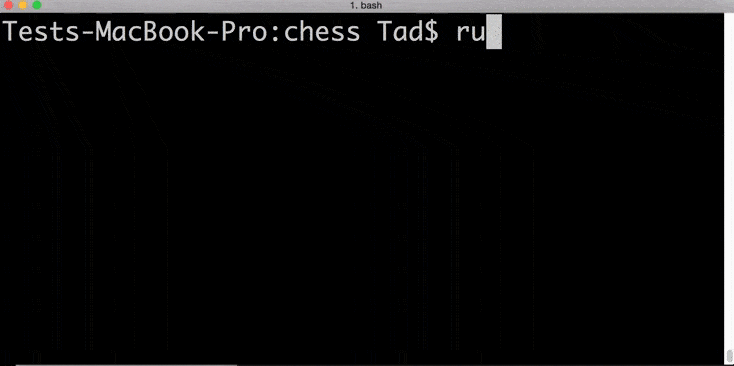

# Chess
Ruby implementation of chess using a command line UI.

AI vs AI

<b>Features</b>
- It's Chess! All the functionality you know and love from this classic game
- Ability to save game and load again later
- Decently intelligent AI (capable of beating me, which may say more about my chess abilities than anything else)
- Three primary game modes, player vs. player, player vs. computer, and computer vs. computer
- Displays possible moves when highlighting a piece

<b>How It Works</b>
- Fully built with Ruby object oriented programming
- Modular code using class inheritance and polymorphism
- AI uses point system to determine best possible move two turns ahead
- Stringify game state using YAML for save/load functionality
- Board reprints during piece or cursor move for instant feedback

<b>How To Play</b>
0. Download <a href="http://installrails.com/steps/choose_os">Ruby</a> if you don't already have it
1. Download this <a href="ruby-chess.zip">chess file</a>
2. Uncompress 'ruby-chess.zip'
3. Navigate to the folder in your command line tool of choice
4. Run the command 'ruby chess.rb'
5. Play!
